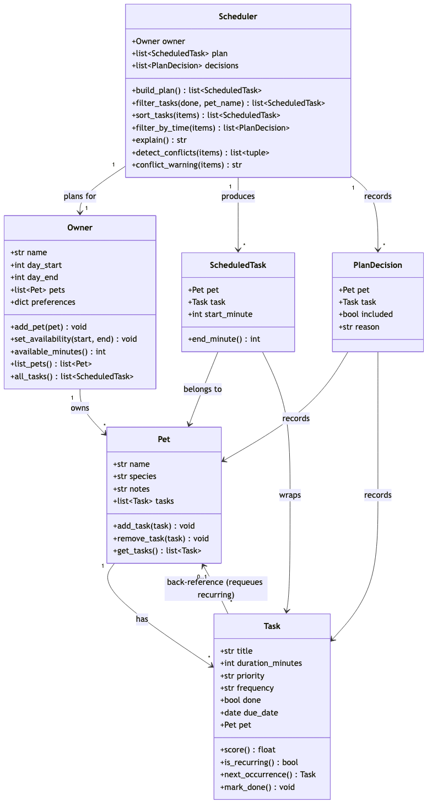

# PawPal+ (Module 2 Project)

You are building **PawPal+**, a Streamlit app that helps a pet owner plan care tasks for their pet.

## Scenario

A busy pet owner needs help staying consistent with pet care. They want an assistant that can:

- Track pet care tasks (walks, feeding, meds, enrichment, grooming, etc.)
- Consider constraints (time available, priority, owner preferences)
- Produce a daily plan and explain why it chose that plan

Your job is to design the system first (UML), then implement the logic in Python, then connect it to the Streamlit UI.

## What you will build

Your final app should:

- Let a user enter basic owner + pet info
- Let a user add/edit tasks (duration + priority at minimum)
- Generate a daily schedule/plan based on constraints and priorities
- Display the plan clearly (and ideally explain the reasoning)
- Include tests for the most important scheduling behaviors

## Getting started

### Setup

```bash
python -m venv .venv
source .venv/bin/activate  # Windows: .venv\Scripts\activate
pip install -r requirements.txt
```

### Suggested workflow

1. Read the scenario carefully and identify requirements and edge cases.
2. Draft a UML diagram (classes, attributes, methods, relationships).
3. Convert UML into Python class stubs (no logic yet).
4. Implement scheduling logic in small increments.
5. Add tests to verify key behaviors.
6. Connect your logic to the Streamlit UI in `app.py`.
7. Refine UML so it matches what you actually built.

## ✨ Features

PawPal+ turns a list of pet-care tasks into an ordered, explained daily plan.
The algorithms behind it (all in `pawpal_system.py`):

- **Priority sorting** — tasks are ranked by a `score()` that weights priority
  (high > medium > low) far above duration, so important care happens first and a
  shorter task breaks ties between equal priorities.
- **Scheduling by time (time-boxing)** — the scheduler greedily packs sorted
  tasks back-to-back into the owner's available window, assigning each a concrete
  start time (e.g. `08:00 — Feeding`). Tasks that don't fit are skipped, not
  crammed past the end of the day.
- **Conflict warnings** — overlapping time slots are detected (half-open
  `[start, end)` intervals, so back-to-back tasks don't false-alarm) and reported
  in plain language, noting whether the clash is same-pet or across pets.
- **Daily & weekly recurrence** — marking a recurring task done automatically
  generates its next occurrence with the due date advanced one interval; one-off
  tasks generate nothing.
- **Filtering** — query tasks by completion status (done / to-do / all) and by
  pet name (case-insensitive), with filters combining.
- **Plan explanations** — every plan can explain itself: what was scheduled,
  when, and *why* each skipped task didn't make the cut.
- **Two front ends** — an interactive Streamlit UI (`app.py`) and a scriptable
  CLI demo (`main.py`).

See the [Smarter Scheduling](#-smarter-scheduling) table below for the exact
methods behind each feature.

## 🧪 Testing PawPal+

Tests live in `tests/test_pawpal.py` and exercise the scheduling logic in
`pawpal_system.py`. Run them from the repo root:

```bash
# Run the full test suite:
python -m pytest

# Verbose (one line per test):
python -m pytest -v
```

### What the tests cover

- **Task basics** — `mark_done()` flips a task's status; adding a task to a pet
  increases its task count.
- **Sorting correctness** — the built plan comes out in chronological,
  non-overlapping start times, and sorting ranks by priority first with shorter
  tasks breaking ties.
- **Recurrence logic** — completing a `daily` task auto-creates a fresh,
  not-done occurrence due the following day; one-off (`once`) tasks spawn nothing.
- **Conflict detection** — tasks sharing (or overlapping) a time slot are
  flagged, `conflict_warning()` returns a readable message, and back-to-back
  tasks (touching but not overlapping) are correctly *not* flagged.
- **Edge cases** — a pet with no tasks yields an empty plan and no conflicts;
  a task too long to fit the day window is skipped rather than scheduled past
  `day_end`.

Sample test output:

```
$ python -m pytest -v
========================= test session starts =========================
collected 11 items

tests/test_pawpal.py::test_mark_done_changes_status PASSED       [  9%]
tests/test_pawpal.py::test_adding_task_increases_pet_task_count PASSED [ 18%]
tests/test_pawpal.py::test_build_plan_returns_tasks_in_chronological_order PASSED [ 27%]
tests/test_pawpal.py::test_sort_orders_by_priority_then_shorter_duration PASSED [ 36%]
tests/test_pawpal.py::test_marking_daily_task_done_creates_next_day_occurrence PASSED [ 45%]
tests/test_pawpal.py::test_marking_once_task_done_does_not_recur PASSED [ 54%]
tests/test_pawpal.py::test_detect_conflicts_flags_tasks_at_the_same_time PASSED [ 63%]
tests/test_pawpal.py::test_conflict_warning_is_nonempty_when_times_overlap PASSED [ 72%]
tests/test_pawpal.py::test_back_to_back_tasks_do_not_conflict PASSED [ 81%]
tests/test_pawpal.py::test_pet_with_no_tasks_produces_empty_plan PASSED [ 90%]
tests/test_pawpal.py::test_task_needing_more_than_remaining_time_is_skipped PASSED [100%]

========================= 11 passed in 0.02s =========================
```

**Confidence level: 4 / 5** — the core behaviors (sorting, time-boxing,
recurrence, and conflict detection) are all covered by passing tests. Not a 5
because a few edge cases (e.g. weekly month/year rollover, cross-pet conflicts,
duplicate-task rejection) aren't tested yet.

## 📐 Smarter Scheduling

All scheduling logic lives in `pawpal_system.py`. Times are stored as
minutes-since-midnight ints (e.g. `08:00` → `480`) to keep the math simple.

The final class design (source: [`diagrams/uml_final.mmd`](diagrams/uml_final.mmd)):



| Feature | Method(s) | Notes |
|---------|-----------|-------|
| Task sorting | `Task.score()`, `Scheduler.sort_tasks()` | Each task's `score()` weights priority (low/medium/high) far above duration, so priority dominates and a shorter task breaks ties. `sort_tasks()` orders candidates by that score, highest first. |
| Filtering by pet / status | `Scheduler.filter_tasks(done, pet_name)` | Optional, combinable filters. `done=True/False` keeps completed/incomplete tasks (`None` keeps both); `pet_name` matches a pet case-insensitively. |
| Time-boxing (fit to the day) | `Scheduler.filter_by_time()`, `Scheduler.build_plan()` | Greedily packs sorted tasks back-to-back from `day_start`; tasks that overflow the window are skipped with a recorded reason. |
| Conflict detection | `Scheduler.detect_conflicts()`, `Scheduler.conflict_warning()` | `detect_conflicts()` returns pairs of tasks whose half-open `[start, end)` time slots overlap (across any pets). `conflict_warning()` wraps it in a friendly message and never raises — returns `""` when clear. |
| Recurring tasks | `Task.is_recurring()`, `Task.next_occurrence()`, `Task.mark_done()` | Completing a `daily`/`weekly` task auto-creates the next occurrence with its `due_date` advanced via `datetime.timedelta` (handles month/year rollover); one-off tasks spawn nothing. |
| Explanation | `Scheduler.explain()` | Renders the timed plan plus a "Skipped" section, so the user can see what was chosen, when, and why. |

## 📸 Demo Walkthrough

PawPal+ runs two ways: an interactive **Streamlit app** (`streamlit run app.py`)
and a **command-line demo** (`python main.py`).

### What the UI lets you do

The Streamlit app is organized top to bottom as a single planning page:

- **Owner** — set your name and how many minutes you have available today (the
  care window starts at 08:00). This defines the time budget the scheduler fills.
- **Add a Pet** — register one or more pets (name + species). Pets and their
  tasks persist across interactions via Streamlit session state.
- **Tasks** — pick a pet, then add care tasks with a title, duration, and
  priority. The current-tasks table can be filtered (All / To do / Done) and is
  shown in the scheduler's own priority order so you can preview how it will plan.
- **Build Schedule** — generate the day's plan, see a conflict check, a
  scheduled-tasks table, a "didn't fit today" list, and a plain-text explanation.

### Example workflow

1. Set the owner name and drag the availability slider (e.g. **120 minutes**).
2. **Add a pet** — say `Biscuit` (dog) — then add another, `Mochi` (cat).
3. Select `Mochi` and **add a task**: `Feeding`, 10 min, priority **high**.
4. Add a few more across both pets with mixed priorities and durations.
5. Click **Generate schedule** and view **Today's Schedule**.

### Key Scheduler behaviors you'll see

- **Sorting** — even though tasks are entered in any order, the plan lists them
  highest-priority first (shorter task wins ties), each with a start time.
- **Time-boxing** — tasks are packed back-to-back within your window; anything
  that overflows appears under **Didn't fit today** with the reason.
- **Conflict warnings** — if two tasks share a time slot, an amber warning names
  both tasks, their times, and the pet(s) affected, with a suggested fix.
- **Recurrence** — completing a `daily`/`weekly` task queues its next occurrence.
- **Explanation** — an expander shows the full plain-text rationale.

### Sample CLI output (`python main.py`)

The CLI demo adds tasks out of order across two pets, then exercises sorting,
filtering, scheduling, and conflict detection:

```text
===== All tasks (insertion order) =====
  [✓] Litter change   15 min | low    | Mochi
  [ ] Feeding         10 min | high   | Mochi
  [ ] Grooming        45 min | low    | Biscuit
  [ ] Enrichment      20 min | medium | Biscuit
  [ ] Morning walk    30 min | high   | Biscuit

===== Sorted by priority (sort_tasks) =====
  [ ] Feeding         10 min | high   | Mochi
  [ ] Morning walk    30 min | high   | Biscuit
  [ ] Enrichment      20 min | medium | Biscuit
  [✓] Litter change   15 min | low    | Mochi
  [ ] Grooming        45 min | low    | Biscuit

===== Filter: not done =====
  [ ] Feeding         10 min | high   | Mochi
  [ ] Grooming        45 min | low    | Biscuit
  [ ] Enrichment      20 min | medium | Biscuit
  [ ] Morning walk    30 min | high   | Biscuit

===== Filter: done =====
  [✓] Litter change   15 min | low    | Mochi

===== Filter: Biscuit only =====
  [ ] Grooming        45 min | low    | Biscuit
  [ ] Enrichment      20 min | medium | Biscuit
  [ ] Morning walk    30 min | high   | Biscuit

===== Today's Schedule =====
Daily plan (120 min available):
  08:00 — Feeding (10 min) [priority: high] for Mochi
  08:10 — Morning walk (30 min) [priority: high] for Biscuit
  08:40 — Enrichment (20 min) [priority: medium] for Biscuit
  09:00 — Grooming (45 min) [priority: low] for Biscuit

===== Conflict Check =====
⚠️  1 scheduling conflict(s) detected:
  Feeding (08:00–08:10, Mochi) overlaps Morning walk (08:00–08:30, Biscuit) [different pets]
```

**Screenshot or video** *(optional)*: <!-- Insert a screenshot or link to a demo video here -->
